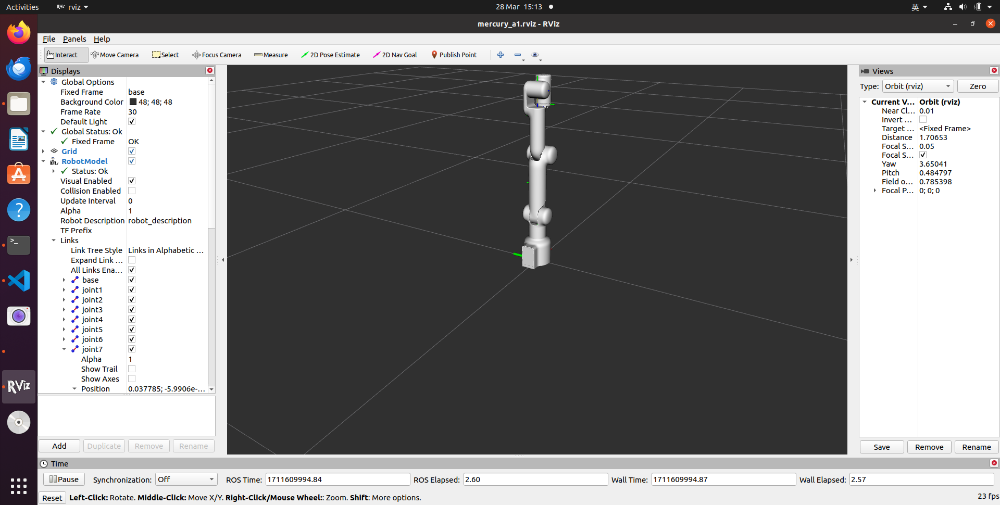
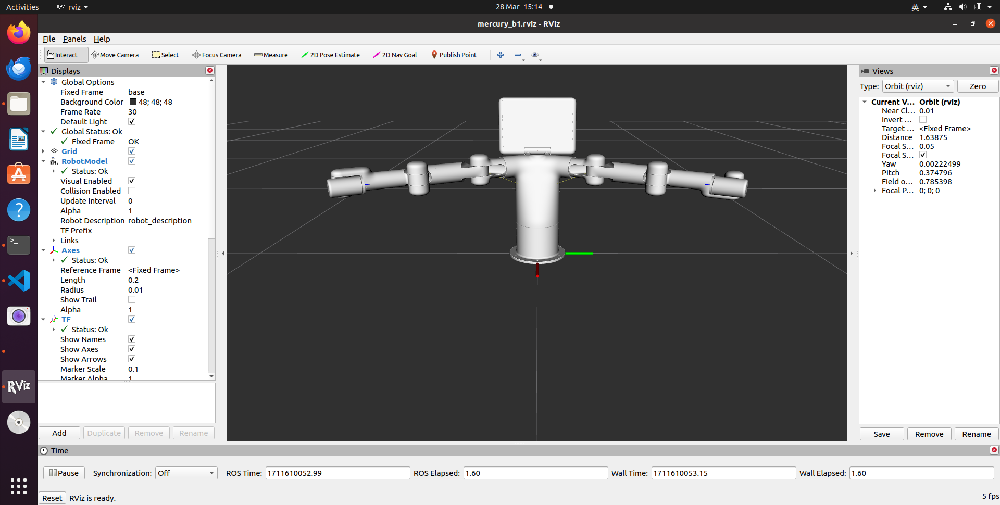

# mercury_ros2

[]([https://www.elephantrobotics.com/docs/myCobot/3-development/4-ros&moveit/](https://docs.elephantrobotics.com/docs/gitbook/12-ApplicationBaseROS/12.2-ROS2/12.2.1-ROS2%E7%9A%84%E5%AE%89%E8%A3%85.html))

[中文文档](https://docs.elephantrobotics.com/docs/gitbook/12-ApplicationBaseROS/12.2-ROS2/12.2.1-ROS2%E7%9A%84%E5%AE%89%E8%A3%85.html)

Mercury ROS2 package

**Notes**:

* Supported ROS2 versions:
  * Ubuntu 20.04 / ROS2 Galactic - branch `galactic`

## Installation

### 1.1 Pre-Requriements

For using this package, the [Python api](https://github.com/elephantrobotics/pymycobot) library should be installed first.

```bash
pip install pymycobot --user
```

Before installing the package, you need to create a ros workspace.

```bash
mkdir -p ~/colcon_ws/src  # Create folder
```

Add a workspace environment

```bash
$ echo "source ~/colcon_ws/install/setup.bash" >> ~/.bashrc
$ source ~/.bashrc
```

### 1.2 Package Download and Install

Install ros package in your src folder of your Colcon workspace.

```bash
$ cd ~/colcon_ws/src
$ git clone --depth 1 https://github.com/elephantrobotics/mercury_ros2.git
$ cd ~/colcon_ws
$ colcon build
$ source install/setup.bash
```

## Run

Here we take Mercury A1 as an example

### 1 test

```bash
ros2 launch merury_a1 test.launch.py
```

### 2 slider control

```bash
ros2 launch mercury_a1 slider_control.launch.py
```

### 3 model follow

```bash
ros2 launch mercury_a1 mercury_follow.launch.py
```

### 4 GUI control

```bash
ros2 launch mercury_a1 simple_gui.launch.py
```

### 5 keyboard control

```bash
ros2 launch mercury_a1 teleop_keyboard.launch.py
```

```bash
ros2 run mercury_a1 teleop_keyboard
```

## URDF Model Graph

[Mercury A1](./mercury_description/urdf/mercury_a1/mercury_a1.urdf)



[Mercury B1](./mercury_description/urdf/mercury_b1/mercury_b1.urdf)

